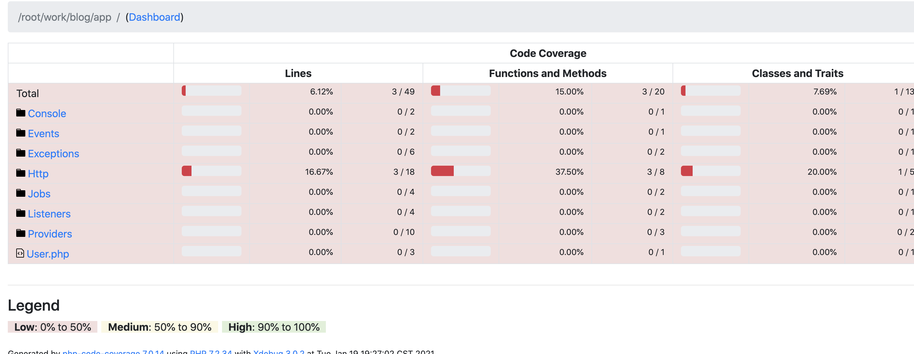
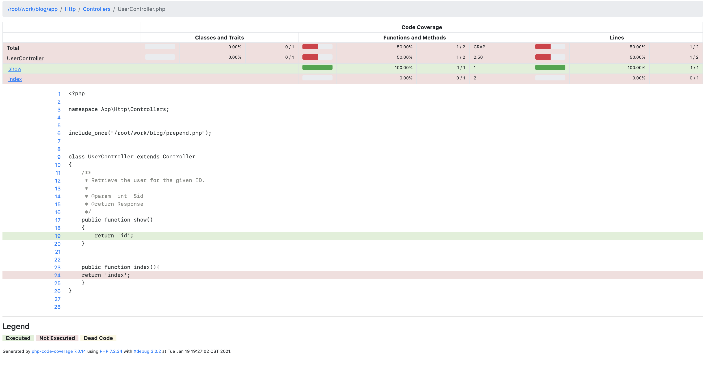

第一期的内容包括
- PHP的全量覆盖率统计
- PHP的增量覆盖率统计
- 数据持久化存储及其展示
- 接入CICD流水线中

[参考:基于 php-code-coverage 的增量代码覆盖率实现](https://testerhome.com/articles/20116)
[参考:代码覆盖率平台实现](https://testerhome.com/articles/23288)
[参考:代码实时染色系统](https://testerhome.com/topics/23915)
---

# 产品分析

开发同学代码完成后，新功能是否有相关的单元测试？

测试同学在测试过程中，测试用例是否足够完善，是否完全覆盖功能点？

多次版本迭代后，是否存在废弃代码？

用例执行了，这部分代码逻辑是否真的执行到了？

代码修改了，需要重新测哪些功能？需要全量回归么？

这些问题都可以通过代码覆盖率平台来解决。

- 一般会用于CI检测中，在test step后添加增量覆盖率检测脚本，增量覆盖率未达标的代码禁止并入代码库
- 也可用于git hook中做检测（这会增加提交代码的等待时长，不太建议），增量覆盖率未达标的代码禁止提交。

## 1. 产品目标
通过统计覆盖率情况，辅助测试同学进行测试工作，查看测试过程中未覆盖代码，提高测试质量。

检测出程序中的废代码，逆向反推在代码设计中思维混乱点，提醒设计/开发人员理清代码逻辑关系，提升代码质量。

实时染色，显示代码覆盖情况，可以清楚看到，执行用例后代码的执行情况，降低漏测场景的复现成本，提高测试效率。

建立代码与用例的关联，代码修改，可以快速在海量回归用例中提取测试需要的用例。

目标：【作图】
- 降低漏测场景的复现成本
- 在项目快速迭代节奏下从容评估回归测试范围
- 在海量用例中提取需要回归的用例组合
- 对现有的自动化接口测试进行效果跟踪和完善
- 通过可视化度量的方式，促进测试质量的提升
- 在CICD流程中，形成质量卡点，强化质量意识

## 2. 用户需求
### 2.1 leader
- 易于形成测试质量指标 
  - 在项目流程中，形成质量卡点，强化质量意识
  - 通过质量指标化，质量仪表可视化，促进测试质量的提升
  
### 2.2 开发
- 提升代码质量
  - 协助开发搜寻历史废弃代码(依托于方法覆盖率，及行覆盖率染色，为废弃代码判断提供依据)
  - 提供代码拆分的指导意见(直观分析热区代码，为优化提供方向支撑)

### 2.3 测试
- 充分了解测试情况，测试是否全面
  - 测试过程中覆盖和未覆盖的地方,可能存在的风险
  - 通过代码实时染色，快速定位未覆盖原因
- 补充/完善用例
  - 避免测试漏测，尽可能发现测试死角，反推测试用例完善
- 精准测试回归，在项目快速迭代节奏下从容评估回归测试范围
  - 自动关联接口用例与接口代码的映射关系，在提交改动的时候，从海量回归case中快速提取测试case
  
## 3. 需求清单

- 能统计当前项目全量/增量覆盖率
- 能查看单次覆盖率报告详情，并下载
- 可以查看项目覆盖率变化情况
- 可以看到执行了一个功能用例后，代码的执行情况
- 代码修改后，可以推荐相关的用例

功能列表
1. 接口测试覆盖率统计
2. 接口测试增量覆盖率统计
3. 单元测试覆盖率统计
4. 单元测试增量覆盖率统计
5. 历史覆盖率报告详情
6. 项目覆盖率变化统计
7. 代码实时染色
8. 代码与用例的映射
9. 增量代码用例推荐


---

1. 平台上关联git上的项目
- 添加/删除
2. 点击项目进入管理页面
- 最近一次覆盖率统计情况：时间 人员 commitId 全量覆盖率 增量覆盖率 较上次结果
- 点击查看具体某一次的覆盖率报告
- 下载某一次报告
- 全量覆盖率 增量覆盖率 变化曲线
-

如何开始、结束测试呢
- 点击开始
  创建任务
  拉代码
  启动
  开始执行接口测试

- 点击结束
  合并，生成全量覆盖率测试报告
  计算，生成增量覆盖率测试报告
  数据存储，入库
  任务完成
  
3. 实时染色设想
- 点击开始
  创建任务
  拉代码
  启动
  
- 测试中
  开始执行接口测试
  后台实时统计覆盖率情况，通过 socket 将覆盖数据传输至前端，前端进行渲染 
  > PS: 最新代码文件，代码增量数据，前端均可在开始测试前获取。socket 只需要传输 行号信息即可

- 点击结束
  合并，生成全量覆盖率测试报告
  计算，生成增量覆盖率测试报告
  数据存储，入库
  任务完成
  
---

## 4. 信息架构
项目管理：

覆盖率统计：

历史数据查看：


## 5. 原型设计

## 6. 技术实现

### 6.1 PHP 接口代码覆盖率

技术选型：xdebug + php-code-coverage

xdebug并非通过插入代码完成代码执行统计，原理：

1、执行PHP脚本

2、XDEBUG在Module_init中重写每种OPCODE的处理函数

3、PHP编译PHP到OPCODE

4、Zend引擎开始执行OPCODE

5、调用Xdebug的OPCODE处理函数，获取文件和行号信息，统计。

6、返回ZEND_USER_OPCODE_DISPATCH，表示需要执行原生的Zend的处理函数

```
#defineZEND_USER_OPCODE_DISPATCH  2 /* calloriginal opcode handler */
```

7、执行原生的Zend的处理函数

php-code-coverage 介绍 
参考资料：http://mtc.baidu.com/academy/detail/article/70

Php-code-coverage是一个开源类库，它提供了收集、处理和展现PHP代码覆盖率信息的功能，可以直接从github获取源码。
使用php-code-coverage工具可以帮助测试人员hold住php代码，它会动态跟踪php代码的执行，合并并生成整个php项目的代码覆盖率，
最终以html、xml或者text等形式展现，同时也能生成Clover、Crap4J、PHPUnit等形式的基于XML的代码覆盖率信息记录文件。
以此为依据，我们可以分析新增的php代码的增量覆盖率，可以分析当前php代码覆盖率，评估测试用例的质量，决定是否要增加某些测试用例以提高代码覆盖率。

我们在php项目测试中将php-code-coverage的api集成到jenkins持续集成自动化测试流程中，产出的代码覆盖率报表非常直观，
其中包括行覆盖率、函数与方法覆盖率、类与特质覆盖率结果，并且可以通过点击目录链接逐层逐级查看代码覆盖情况，以便测试人员对测试用例覆盖情况进行分析。


#### 6.1.1 全量方案

流程：
1. 每一次进行测试收集覆盖率时，先清除历史数据
2. 进行接口测试，生成每一次的请求覆盖率
3. 测试结束，对本次测试的覆盖率结果进行合并，生成可视化报告
4. 数据持久化存储，做数据展示

#### 6.1.2 全量简单demo
在开启xdebug的情况下，对PHP项目 myDemo 进行接口覆盖率测试，路径为/root/work/myDemo

1.myDemo 项目中，引入 "phpunit/phpunit": "^8.5" 或 "phpunit/php-code-coverage" 

> phpunit/phpunit 中包含了 phpunit/php-code-coverage

```
  composer require --dev phpunit/phpunit:8.5
```

2.myDemo 项目根目录下，准备文件 prepend.php

```
<?php
require_once dirname(__FILE__).'/vendor/autoload.php';
use SebastianBergmann\CodeCoverage\CodeCoverage;
$coverage = new CodeCoverage;
# 设置白名单，就是设置你想计算覆盖率的哪些文件夹
$coverage->filter()->addDirectoryToWhitelist(dirname(__FILE__) . '/app');

$coverage->start('<Site coverage>');#开始统计
register_shutdown_function('__coverage_stop',$coverage);#注册关闭方法

function __coverage_stop(CodeCoverage $coverage){
    $coverage->stop();#停止统计
    $cov = '<?php return unserialize(' . var_export(serialize($coverage), true) . ');';#获取覆盖结果，注意使用了反序列化
    file_put_contents(dirname(__FILE__).'/cov/site.' . date('U') .'.'.uniqid(). '.cov', $cov);#将结果写入到文件中
}
```
3.在需要进行覆盖率测试的文件中，引入prepend.php文件【暂时，后续可以在index文件中添加】
```
include_once("/root/work/myDemo/prepend.php");
```
4.开始进行接口测试，项目根目录下的/cov文件中会生成每一次请求的覆盖率统计结果。
   
可以将其合并成一份结果。

为了避免版本冲突，新建文件夹 /root/work/myCov，安装 phpcov， 用来进行合并报告的操作
```
composer require --dev phpunit/phpcov:6.0.
```

执行合并报告，将cov文件夹里的报告，合并成html格式的报告，存在report文件夹中，点击index.html查看
```
/root/work/myCov/vendor/bin/phpcov merge /root/work/myDemo/cov --html /root/work/myDemo/report

/root/work/myCov/vendor/bin/phpcov merge /root/work/myDemo/cov --html /root/work/myDemo/report
```

5. 生成的报告





#### 6.1.3 增量方案
流程：
1. 生成代码diff文件
2. 得到每个文件增量变化的行号
3. 获取测试中未覆盖代码情况
4. 进行数据分析，计算得到增量覆盖率

> 参考：https://www.sohu.com/a/326621612_741445

1. 生成代码diff文件

git diff 旧的 新的 > 路径
``` 
git diff 9102bfe87637891f1186e18110107398469da277 c70b4c38ce35df6108e8a2bb84cbffd9b8924abf > /root/work/php_demo/tmp/patch.txt
```
diff文件
```
diff --git a/app/Http/Controllers/PersonController.php b/app/Http/Controllers/PersonController.php
new file mode 100644
index 0000000..ac4d26c
--- /dev/null
+++ b/app/Http/Controllers/PersonController.php
@@ -0,0 +1,18 @@
+<?php
+
+namespace App\Http\Controllers;
+
+
+include_once("/root/work/blog/prepend.php");
+
+
+class PersonController extends Controller
+{
+
+    public function delete()
+    {
+        return 'delete person';
+    }
+
+
+}
diff --git a/app/Http/Controllers/StudentController.php b/app/Http/Controllers/StudentController.php
index 15ac66b..ba1387a 100644
--- a/app/Http/Controllers/StudentController.php
+++ b/app/Http/Controllers/StudentController.php
@@ -23,4 +23,12 @@ class StudentController extends Controller
     public function list(){
         return 'studentList';
     }
+
+    public function find(){
+        return 'find student 1 ';
+    }
+
+    public function add(){
+        return 'add student 1 ';
+    }
 }
diff --git a/routes/web.php b/routes/web.php
index adecc10..6bede8a 100644
--- a/routes/web.php
+++ b/routes/web.php
@@ -19,5 +19,7 @@ $router->get('test', 'UserController@index');
 
 $router->get('student', 'StudentController@student');
 $router->get('studentList', 'StudentController@list');
-
+$router->get('studentFind', 'StudentController@find');
+$router->get('studentAdd', 'StudentController@add');
+$router->get('delete', 'PersonController@delete');
 

```
2. 整理成标准格式，每个文件增量变化的行号
``` 
web.php：[19, 20, 21, 22, 23, 24, 25]
PersonController.php：[1, 2, 3, 4, 5, 6, 7, 8, 9, 10, 11, 12, 13, 14, 15, 16, 17, 18]
StudentController.php：[23, 24, 25, 26, 27, 28, 29, 30, 31, 32, 33, 34]
```

3. 获取未覆盖代码情况
```
/root/work/aaaa/vendor/bin/phpcov patch-coverage /root/work/php_demo/cov/site.1611211569.600923319645e.cov              \
--patch /root/work/php_demo/tmp/patch.txt         \
--path-prefix /root/work/php_demo
```

(1) 输出1
``` 
phpcov 6.0.1 by Sebastian Bergmann.

1 / 1 changed executable lines covered (100.00%)

```

(2) 输出2
```
phpcov 6.0.1 by Sebastian Bergmann.

0 / 9 changed executable lines covered (0.00%)

Changed executable lines that are not covered:

app/Http/Controllers/PersonController.php:6
app/Http/Controllers/PersonController.php:13
app/Http/Controllers/PersonController.php:14
app/Http/Controllers/PersonController.php:15
app/Http/Controllers/StudentController.php:6
app/Http/Controllers/StudentController.php:28
app/Http/Controllers/StudentController.php:29
app/Http/Controllers/StudentController.php:32
app/Http/Controllers/StudentController.php:33    
```

```
phpcov 6.0.1 by Sebastian Bergmann.

1 / 7 changed executable lines covered (14.29%)

Changed executable lines that are not covered:

app/Http/Controllers/StudentController.php:6
app/Http/Controllers/StudentController.php:28
app/Http/Controllers/StudentController.php:29
app/Http/Controllers/StudentController.php:32
app/Http/Controllers/StudentController.php:33
app/Http/Controllers/UserController.php:6
```
4. 可以分析得到每个文件未覆盖的行号

``` 
StudentController.php:[28,29]
```

5. 根据2、4得到的文件，可以计算每个文件的增量覆盖率和总体覆盖率
参考：http://www.51testing.com/html/87/n-4473887.html?nomobile=1
> 但还需要考虑一种情况：由于一些原因（可是配置文件的问题）导致一些源码文件未被统计到测试覆盖率报告中，那么 + 有意为之，则增量文件不用计入增量覆盖率中，此文件的增量覆盖率是 100% + 无意为之，则增加文件需要计入增量覆盖率中，此文件的增量覆盖率是 0

类似以下数据
```
文件web.php 覆盖率 0.00
      行号 [19, 20, 21, 22, 23, 24, 25] 没有被覆盖到
文件UserController.php 覆盖率 0.00
      行号 [3, 4, 5, 6, 7, 8, 9] 没有被覆盖到
文件PersonController.php 覆盖率 0.00
      行号 [1, 2, 3, 4, 5, 6, 7, 8, 9, 10, 11, 12, 13, 14, 15, 16, 17, 18] 没有被覆盖到
文件StudentController.php 覆盖率 0.84
      行号 [25, 26, 27] 没有被覆盖到
覆盖率 0.31 

Process finished with exit code 0

```


